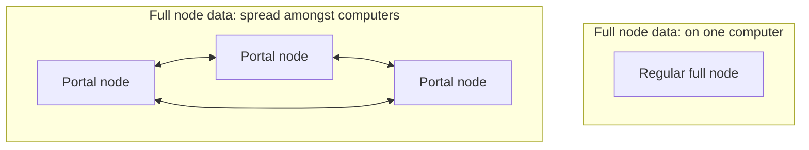

# Concepts

## Why does Portal Network exist?

Portal is an important way to support the evolution of the core Ethereum protocol.

To relieve pressure on Ethereum clients, the core protocol will allow full nodes to forget old data in a
likely future upgrade.

When that happens, the Portal Network can supply users with that purged data.

## How do Portal clients use less space?

Each Portal Network client stores a user-configurable fraction of the data. The client retrieves any missing data from peers, on demand. Just like a full node, the client can cryptographically prove the data it serves.

