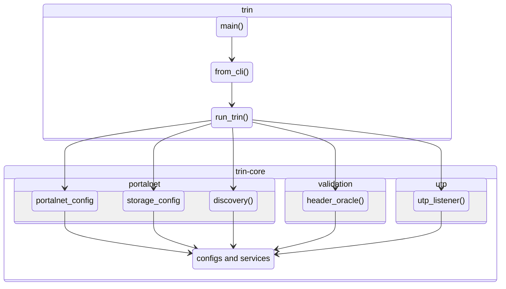
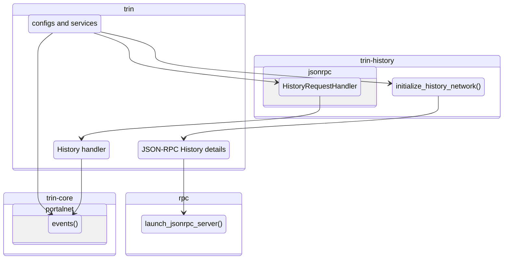

# Process flow

The following main threads are spawned when Trin is started via `./src/main.rs`.

Where for each sub-protocol implemented (History, State, Etc.,), a new thread is started.

Here are some of the major components of trin-core that are called on startup within `./trin-core/src/lib.rs`.

Once the initial collection of important configs and services have
been aggregated, they are passed to the crates for each sub-protocol (`trin-history` shown here). The received data structures are then
used to start the JSON-RPC server.

An events listener awaits network activity that can be actioned.

Then `./trin-core/portalnet/events.rs` is handles events at the level of the Portal Wire Protocol.
These are defined messages that are compliant with the Discv5 protocol, and specific
to the Portal Network.