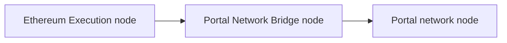
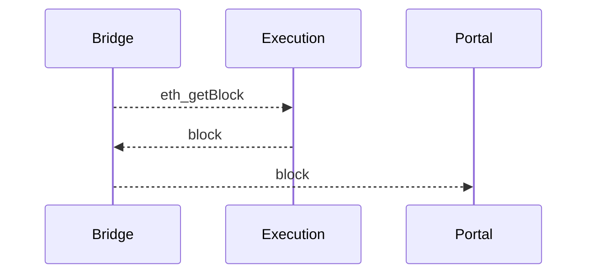

# Bridge

Blocks are produced by Ethereum Execution clients which use a different
network to Portal Network nodes. A Bridge node is responsible for taking data
from the external network and passing it to the Portal Network.

This operates as follows:

Currently the bridge functionality exists as a separate python application
with plans to implement in Trin.