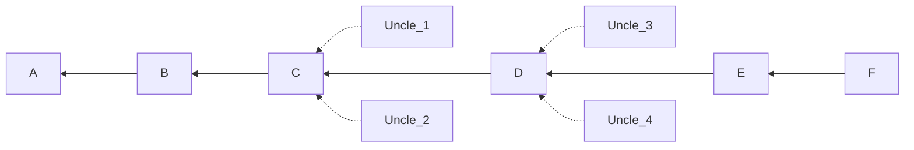
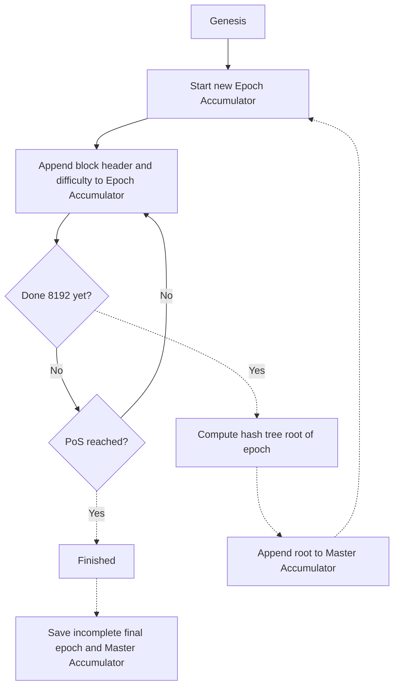

# Cryptographic accumulator

A cryptographic accumulator is a structure that allows verification of a specific
block header in the past is part of the canonical chain.

The History sub-protocol is responsible for accumulator-related data.

An accumulator has been constructed for the Portal Network, because it is too burdensome to
keep all the headers on disk. This applies to pre-merge blocks. For post-merge blocks, the Beacon Chain already maintains an accumulator that Trin can use via a Beacon Chain light client.

## Canonicality

A block can be valid but not canonical if it is an Uncle. Blocks A-F are canonical, with F
being the latest block.

While Uncle_1 may have a valid block difficulty and parent, it was not built upon.


If a Trin node is presented with such a block, it can check the accumulator, which only
processes non-uncle blocks A-F.

## Tip knowledge

First, the most recent block hash at the tip of the accumulator must be known.

This is easy, as the accumulator only needs to cover pre-merge blocks. The
final pre-merge block (last Proof of Work block) hash is known and never needs to be updated.

## Proofs

A Merkle proof can be constructed for any given historical block hash. The proof asserts
that a given hash (from a peer) is part of the accumulator (valid based on knowledge of the
current chain tip).

A proof cannot be constructed for any other sort of block (Uncle block, fabricated block).

## Accumulator construction

The accumulator is specifically a double-batched merkle log accumulator.

First historical blocks are processed in batches called Epochs (unrelated to the concept
of a 32-slot epoch in the Beacon Chain).

The accumulator constructor consists of two lists:
- One cache for holding blocks (header and difficulty).
- One final store (Master Accumulator) that the cache roots are added to.


Thus the final output is a list of roots called the Master Accumulator.

## Constructing proofs

If you have a block and you know the block number, then you know which epoch
root is relevant. You also know which part of the epoch it came from. That is,
you know the index of the leaf in the Merkle tree.

With the root of the tree, the index and the data (the block hash in question), a proof
can be constructed showing that this leaf was part of the tree.

## Proof use

A proof can be to a peer alongside the data. That way, a peer can quickly and check
that the data is canonical.

## Accumulator distribution

The Accumulator is built once and then distributed in Trin (and other clients). It does not
change over time and so can be incorporated into the `trin-validation` (`./crates/validation/src/assets`) and
included in binary releases.

The History network contains individual epoch hashes from the Master Accumulator and
refers to them with the terms: `epoch_accumulator` and `epoch_accumulator_key`
(includes selector). See the History sub-protocol section of the Portal Network spec.

## Master accumulator details
The Master Accumulator consists of:
- 1895 complete epoch roots
- 1 incomplete epoch root (a partial epoch with 5362 records (block headers))

```csv
epoch,index
8191,0x5ec1ffb8c3b146f42606c74ced973dc16ec5a107c0345858c343fc94780b4218 // first epoch
16383,0xa5364e9a9bc513c4601f0d62e6b46dbdedf3200bbfae54d6350f46f2c7a01938
...
15523839,0x804008940c025a4e8a00ea42a659b484ba32c14dff133e9d3b7bf3685c1e54de // penultimate epoch (full)
15532031,0x3f81607c8cb3f0448a11cab8df0e504b605581f4891a9a35bd9c0dd37a71834f // final epoch (incomplete)
```
Final PoW block: `15537393`

The hash tree root of the Master Accumulator is:
```sh
0x8eac399e24480dce3cfe06f4bdecba51c6e5d0c46200e3e8611a0b44a3a69ff9
```
