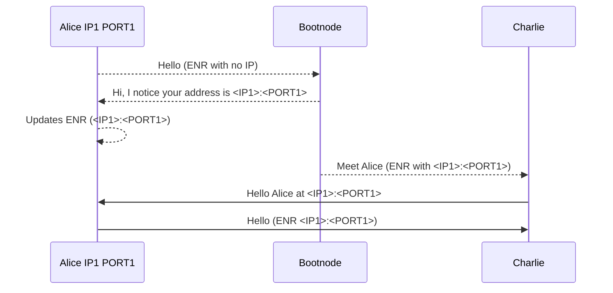
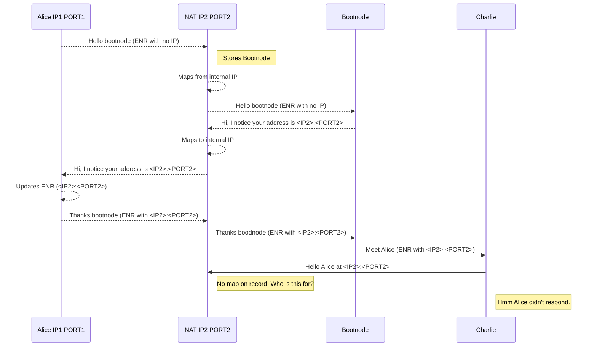
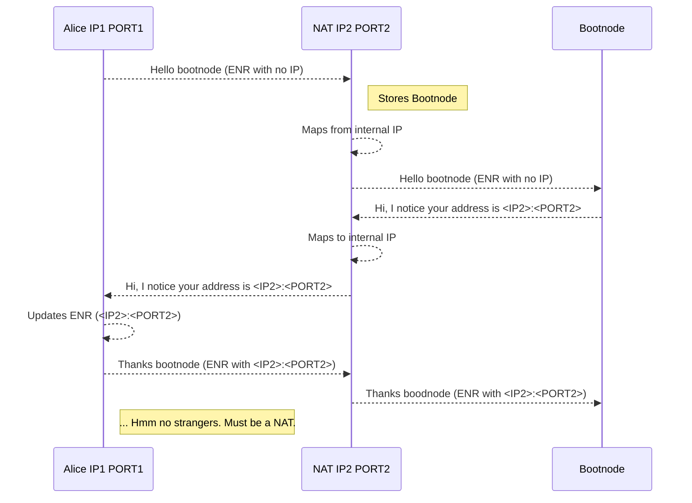
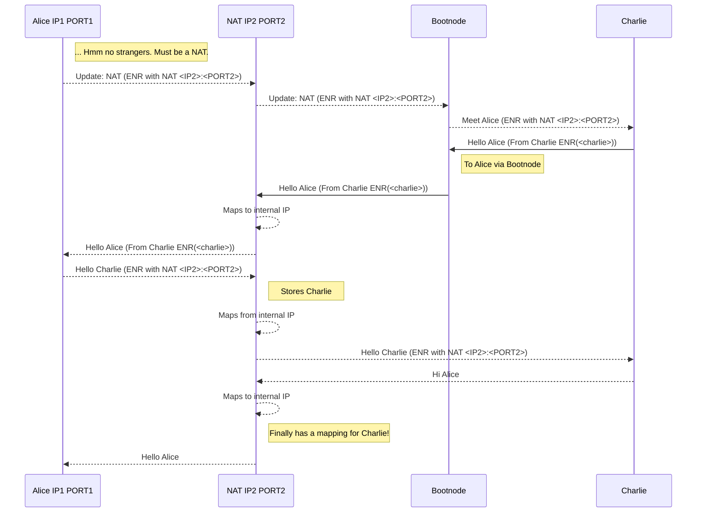

# Finding peers

If a peer is in a network behind a NAT (Network Address Translation) table, the process for
finding a peer is more complicated.

These diagrams are indended as a rough-guide.

## Non-NAT simple case

The bootnode can gossip to Charlie who can then directly contact Alice.

## NAT problem

The bootnode can gossip to Charlie, but Charlie is a stranger from the NAT's perspective.
It doesn't know who on the internal network is the recipient.

- The NAT remembers who it has spoken to.
- Messages from the bootnode are expected.
- Messages from Charlie are not expected, and its not clear who they are for. Perhaps
the smart fridge?

## The NAT solution

If Alice knows she is behind a NAT, she can pass a message which goes:

"I'm behind a NAT. Send your requests via peers and I'll reach out to you."

- The bootnode gossips to Charlie
- Charlie sees "NAT" in Alices ENR
- Charlie asks the bootnode to introduce him to Alice
- Alice reaches out to Charlie
- The NAT now has a mapping for Charlie-Alice messages.

### Part 1: NAT detection

Alice can suspect that she is behind a NAT probabalitically.
If 2 minutes after connecting with a bootnode, no strangers (like Charlie)
have reached out, a NAT is likely.

### Part 2: NAT communication

Alice can put "NAT" in her ENR. Now when Charlie tries to get in touch,
he knows to go via a peer.

Continued from above, skipping Charlie's failed attempt to contact Alice directly.

