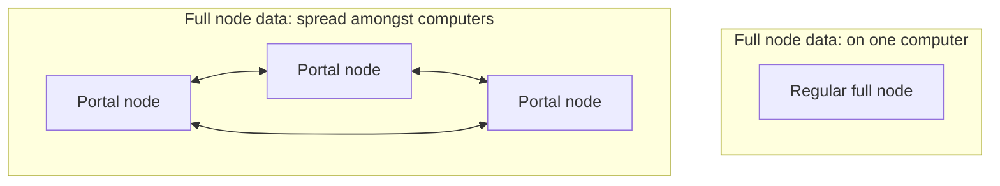

# Introduction

> This book is about Trin, which is software used to interact with the Ethereum protocol
via the Portal Network.

Trin is a Portal network client which acts as a json-rpc server with:
- Nearly instant sync
- Low CPU & storage usage

The Ethereum protocol will allow full nodes to forget old data in an
likely future upgrade. Portal network nodes can supply users with that data.

Trin makes it possible to access Ethereum with less computer resources
than a regular full node. It does this by spreading data amongst peers.

&#x1F3D7; The sections, content and links of this book are subject to change.