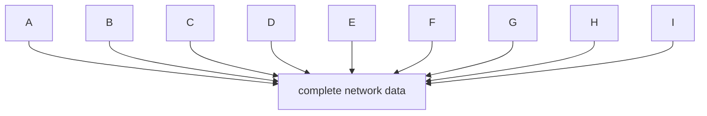
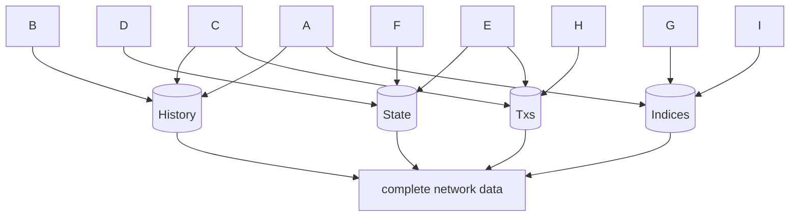
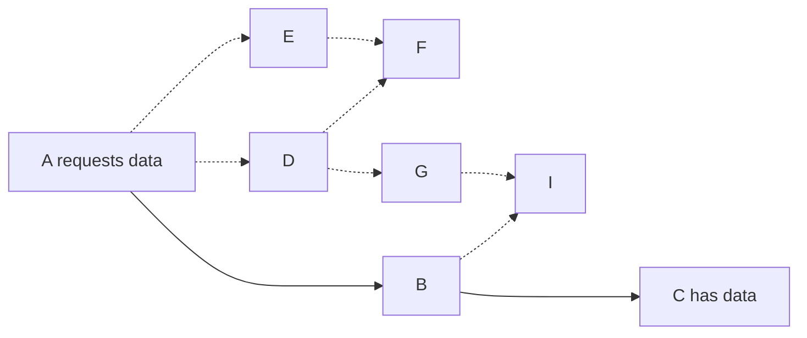
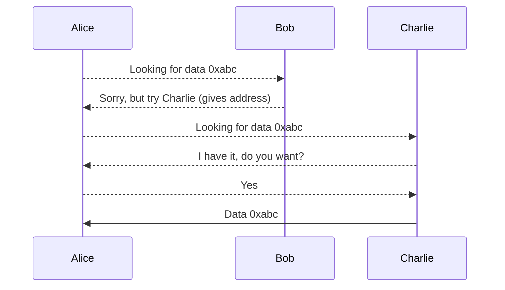
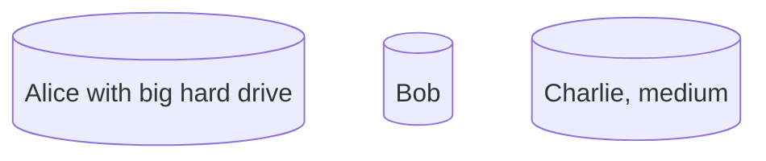

# Portal Network

The portal network is a response to two needs. Users should have the ability to:
- Access Ethereum using peers (not providers) from 'small' computers.
    - An old nice-to-have.
- Access historical data once "history expiry" upgrade goes live
    - A likely future need.

## What is "history expiry"

[EIP-4444: Bound Historical Data in Execution Clients](https://eips.ethereum.org/EIPS/eip-4444)
is an upgrade that seeks to limit the costs of participating in the network. It does this
by allowing by clearing data older than 1 year.

## How the Portal network works

### Small users working together

The portal network consists of many small nodes that each contribute to the whole.
Each node is allocated a specific part of the network to obtain from peers and
serve back to the network.

The portal network splits data in to different types (e.g., blocks vs new transactions).
Each distinct type is effectively a new network. A portal client such as Trin can be used to
operate on each/all of these different sub-protocols.

### Dedicated sub-protocols
Users can elect to be part of some sub-networks:

### Peer referrals based on names
Nodes make requests to each other for data. If they don't have the data, they look at their peers and
suggest one that is most likely to.

### Standard requests
Node each have a name, and only hold data that is similar to that name. Peers can tell who
is likely to have what data based on these names.

### Tunable resources

Nodes keep content that is similar to their name. That similarity radius can be made
larger to voluntarily hold more data.

In addition to Trin, other portal clients are in development and participate in the same network.
