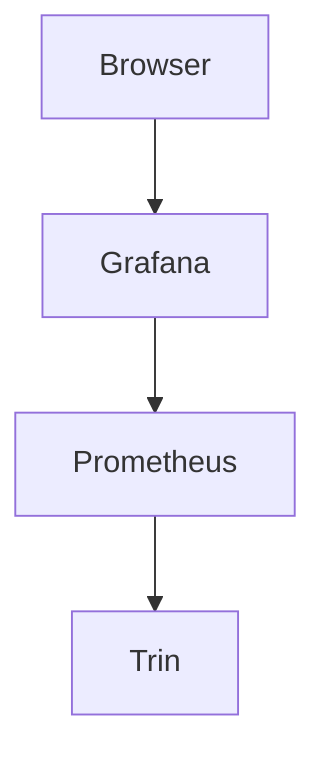

# Monitoring

Once Trin is running, the following may be useful

## Logs

If errors are encountered, they will be logged to the console in which
Trin was started.

Be aware that The `RUST_LOG` variable allows for control of what logs are visible.

- `RUST_LOG=info cargo run -p trin`
- `RUST_LOG=debug cargo run -p trin`

If started as a systemd service logs will be visible with:
```sh
journalctl -fu <trin-service-name>.service
```

## Disk use

The following locations are where trin stores data by default:
- Mac Os: `~/Library/Application Support/trin`
- Unix-like: `$HOME/.local/share/trin`
```sh
cd /path/to/data
du -sh
```

## CPU and memory use

`htop` can be used to see the CPU and memory used by trin

- Ubuntu: `sudo apt install htop`
- Mac Os: `brew install htop`

```sh
htop
```

## Metrics
Prometheus maintains a database of metrics. Grafana converts metrics into graphs.



1. [Install Docker](https://docs.docker.com/engine/install/).

2. From the `metrics` directory run:
```sh
docker compose up
```

3. Start your Trin process exposing metrics:
```sh
cargo run -p trin -- --enable-metrics-with-url 0.0.0.0:9100 --web3-http-address http://0.0.0.0:8545 --web3-transport http
```
- The addresses must be bound to 0.0.0.0, because 127.0.0.1 only allows internal requests to
  complete, and requests from docker instances are considered external.
- The `--enable-metrics-with-url` parameter is the address that Trin exports metrics to, and should be equal to the port to which your Prometheus server is targeting at the bottom of `prometheus/prometheus.yml`
- The `--web-transport http` will allow Grafana to request routing table information from Trin via JSON-RPC over HTTP

4. Navigate to http://localhost:3000/d/trin-metrics/trin-metrics. Use `admin`/`admin` to login.


## Gotchas

- There is a limit on concurrent connections given by the threadpool. At last
  doc update, that number was 2, but will surely change. If you leave
  connections open, then new connections will block.
