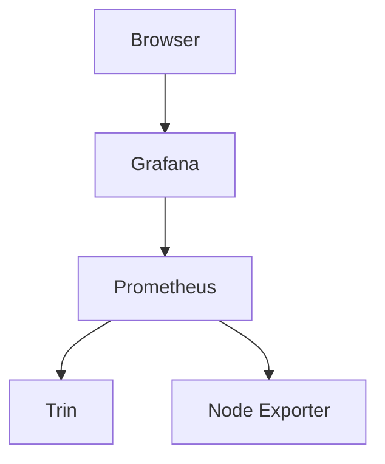

# Monitoring

Once Trin is running, the following may be useful

## Logs

If errors are encountered, they will be logged to the console in which
Trin was started.

Be aware that The `RUST_LOG` variable allows for control of what logs are visible.

- `RUST_LOG=info cargo run -p trin`
- `RUST_LOG=debug cargo run -p trin`

If started as a systemd service logs will be visible with:
```sh
journalctl -fu <trin-service-name>.service
```

## Disk use

The following locations are where trin stores data by default:
- Mac Os: `~/Library/Application Support/trin`
- Unix-like: `$HOME/.local/share/trin`
```sh
cd /path/to/data
du -sh
```

## CPU and memory use

`htop` can be used to see the CPU and memory used by trin

- Ubuntu: `sudo apt install htop`
- Mac Os: `brew install htop`

```sh
htop
```

## Metrics

Prometheus maintains a database of metrics (trin & system). Grafana converts metrics into graphs. Node exporter provides system information.


### Install prometheus

Download the latest prometheus [https://prometheus.io/download/](https://prometheus.io/download/)

```sh
curl -LO <link>
```
Checksum
```sh
sha256sum <filename>
```
Extract
```sh
tar xvf <filename>
```
The directory will contain the binaries for prometheus and promtool. Copy these.
```sh
cd <dirname>
sudo cp prometheus /usr/local/bin/
sudo cp promtool /usr/local/bin/
```
Copy the console files
```sh
sudo cp -r consoles /etc/prometheus
sudo cp -r console_libraries /etc/prometheus
```
Remove the downloaded files
```sh
cd ~
rm <tar filename>
rm -r <extracted prometheus directory>
```
Make a prometheus user
```sh
sudo useradd --no-create-home --shell /bin/false prometheus
```
Create a prometheus data directory
```sh
sudo mkdir -p /var/lib/prometheus
```
Make a config file
```sh
sudo nano /etc/prometheus/prometheus.yml
```
Put this in the config file:
```yml
global:
  scrape_interval:     15s
  evaluation_interval: 15s

alerting:
  alertmanagers:
  - static_configs:
    - targets:
rule_files:

scrape_configs:
  - job_name: 'node_exporter'
    static_configs:
      - targets: ['localhost:9100']
  - job_name: 'trin'
    static_configs:
      - targets: ['localhost:9101']
```
The `node_exporter` job will gather system data by listening to port `9100`.
The `trin` job will gather system data by listening to port `9101`.

Update the permissions
```sh
sudo chown -R prometheus:prometheus /etc/prometheus
sudo chown -R prometheus:prometheus /var/lib/prometheus
```
Prometheus will use port 9090 by default. Check it is not used by something else:
```sh
sudo lsof -i:9090
```
Create a service for prometheus
```sh
sudo nano /etc/systemd/system/prometheus.service
```
Include the following, pick another port if 9090 is already in use.
```ini
[Unit]
Description=Prometheus
Wants=network-online.target
After=network-online.target

[Service]
Type=simple
User=prometheus
Group=prometheus
Restart=always
RestartSec=5
ExecStart=/usr/local/bin/prometheus \
    --config.file /etc/prometheus/prometheus.yml \
    --storage.tsdb.path /var/lib/prometheus/ \
    --web.console.templates=/etc/prometheus/consoles \
    --web.console.libraries=/etc/prometheus/console_libraries \
    --web.listen-address="localhost:9090"
ExecReload=/bin/kill -HUP $MAINPID

[Install]
WantedBy=multi-user.target
```
Start the service
```sh
sudo systemctl daemon-reload
sudo systemctl start prometheus
sudo systemctl status prometheus
sudo systemctl enable prometheus
```

### Install node exporter

Download the latest node exporter [https://prometheus.io/download/#node_exporter](https://prometheus.io/download/#node_exporter)

```sh
curl -LO <link>
```
Checksum
```sh
sha256sum <filename>
```
Extract
```sh
tar xvf <filename>
```
The directory will contain the binary for node exporter. Copy this.
```sh
cd <dirname>
sudo cp node_exporter /usr/local/bin/
```
Remove the downloaded files
```sh
cd ~
rm <tar filename>
rm -r <extracted node_exporter directory>
```
Make a node_exporter user and give it permission to the binary.
```sh
sudo useradd --no-create-home --shell /bin/false node_exporter
sudo chown -R node_exporter:node_exporter /usr/local/bin/node_exporter
```
Make a service file:
```sh
sudo nano /etc/systemd/system/node_exporter.service
```
Start the service
```sh
sudo systemctl daemon-reload
sudo systemctl start node_exporter
sudo systemctl status node_exporter
sudo systemctl enable node_exporter
```
Node explorer uses port 9100 by default.

### Install grafana

Install
```sh
sudo apt-get install -y apt-transport-https software-properties-common wget
sudo wget -q -O /usr/share/keyrings/grafana.key https://apt.grafana.com/gpg.key
echo "deb [signed-by=/usr/share/keyrings/grafana.key] https://apt.grafana.com stable main" | sudo tee -a /etc/apt/sources.list.d/grafana.list
sudo apt update
sudo apt install grafana
```
Open config
```sh
sudo nano /etc/grafana/grafana.ini
```
Modify the `http_adr` line to use localhost
```ini
[server]
;http_addr = # Before
http_addr = localhost # After
```
Start grafana
```sh
sudo systemctl daemon-reload
sudo systemctl start grafana-server
sudo systemctl status grafana-server
sudo systemctl enable grafana-server
```
This will serve metrics over port 3000.

Generate a grafana dashboard. From trin root directory:
```sh
cargo run -p trin-cli -- create-dashboard
```
This will create a new monitoring database for trin. This will
be visible in the grafana GUI, or directly at a URL similar to:
http://localhost:3000/d/trin-app-metrics/trin-app-metrics

If you would like to run the create-dashboard command again, the
data source and the dashboard must be deleted, which can be done in the grafana GUI.

### Start trin with metrics on

The metrics port must match the trin job set in: `/etc/prometheus/prometheus.yml`.

```sh
cargo run -p trin -- \
    --enable-metrics-with-url 127.0.0.1:<metrics job port> \
    --web3-http-address http://127.0.0.1:<http port> \
    --web3-transport http
```
For example:

```sh
cargo run -p trin -- \
    --enable-metrics-with-url 127.0.0.1:9101 \
    --web3-http-address http://127.0.0.1:8545 \
    --web3-transport http
```

### View metrics remotely


Trin metrics on a remote machine can be monitored by listening to the grafana
address on a local machine.

On local run:
```sh
ssh -N -L <port>:127.0.0.1:<port> <user>@<host>
```
For example
```sh
ssh -N -L 3000:127.0.0.1:3000 username@mycomputer
```
Then navigate to [http://127.0.0.1:3000](http://127.0.0.1:3000)` in a browser and login
with username: admin, password: admin. Then navigate to the trin-app-metrics dashboard.

